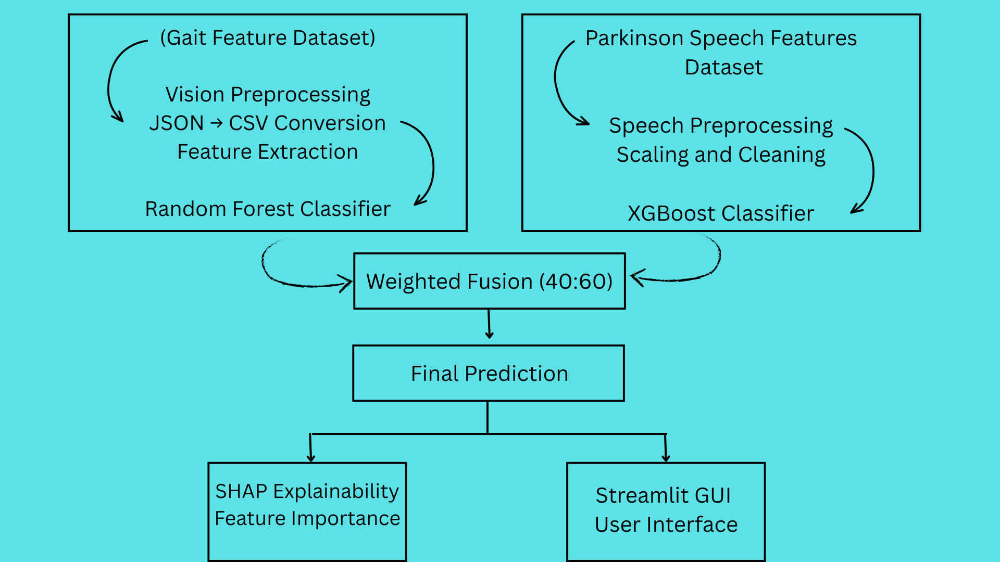

# 🧠 Explainable Multimodal AI System for Early Parkinson's Disease Screening

> An Explainable Artificial Intelligence (XAI) based multimodal system that combines **Computer Vision** and **Speech Analysis** for early Parkinson's disease screening using Machine Learning.


---

# 📌 Project Overview

Parkinson's Disease is a progressive neurological disorder where early diagnosis plays a vital role in improving treatment outcomes. This project presents an **Explainable Multimodal AI System** that integrates **vision-based gait analysis** and **speech analysis** to predict Parkinson's disease.

The application combines predictions from multiple machine learning models using a weighted fusion strategy and provides explainable predictions through **SHAP (SHapley Additive exPlanations)**.

---

# ✨ Features

- 👁️ Vision-based Parkinson's Disease Prediction
- 🎤 Speech-based Parkinson's Disease Prediction
- 🔀 Multimodal Prediction Fusion
- 📊 Explainable AI using SHAP
- 📁 CSV-based Prediction Interface
- 🌐 Interactive Streamlit Web Application
- 📈 Confidence Score Generation

---

# 🏗️ System Architecture

<p align="center">

</p>

---

# 🔄 Workflow

```text
Vision CSV
        │
        ▼
Random Forest Model
        │
        │
        ├──────────────┐
        │              │
        ▼              ▼
     Fusion Layer  ← Speech CSV
                        │
                        ▼
                  Feature Scaling
                        │
                        ▼
                   XGBoost Model
                        │
                        ▼
               Final Prediction
                        │
                        ▼
               SHAP Explainability
```

---

# 📂 Project Structure

```text
Explainable-Multimodal-AI-for-Parkinsons-Disease-Screening
│
├── app.py
├── README.md
├── requirements.txt
│
├── models
│   ├── parkinson_rf.pkl
│   ├── speech_xgboost_model.pkl
│   └── speech_scaler.pkl
│
├── sample_data
│   ├── vision_sample.csv
│   └── speech_sample.csv
│
├── screenshots
│   ├── homepage.png
│   ├── prediction.png
│   └── shap.png
│
└── assets
    └── architecture.png
    
```

---

# 💻 Technologies Used

- Python
- Streamlit
- Pandas
- NumPy
- Scikit-Learn
- XGBoost
- SHAP
- Matplotlib
- OpenCV

---

# 🤖 Machine Learning Models

| Modality | Model |
|----------|-------|
| Vision Analysis | Random Forest |
| Speech Analysis | XGBoost |
| Explainability | SHAP |

---

# 📊 Dataset

The project uses publicly available Parkinson's Disease datasets for both modalities.

### Vision Dataset
- Human gait and movement features extracted from Computer Vision.

### Speech Dataset
- Voice-based acoustic features for Parkinson's disease detection.

---

# 🚀 Installation

Clone the repository

```bash
git clone https://github.com/yourusername/Explainable-Multimodal-AI-for-Parkinsons-Disease-Screening.git
```

Go to the project directory

```bash
cd Explainable-Multimodal-AI-for-Parkinsons-Disease-Screening
```

Install dependencies

```bash
pip install -r requirements.txt
```

Run the application

```bash
streamlit run app.py
```

---

# 🖥️ Application Interface

## Home Screen

<p align="center">

</p>

---

## Prediction Results

<p align="center">

</p>

---

## Explainable AI (SHAP)

<p align="center">

</p>

---

# 📈 Output

The application provides

- Vision Prediction Score
- Speech Prediction Score
- Healthy Probability
- Parkinson's Probability
- Final Disease Prediction
- Confidence Score
- SHAP-based Feature Importance

---

# 🔮 Future Enhancements

- Real-time webcam-based gait analysis
- Voice recording instead of CSV upload
- Deep Learning based multimodal fusion
- Mobile application deployment
- Cloud deployment using Streamlit Community Cloud

---

# 👩‍💻 Author

**Aysha Mahmood**

B.Tech (Electronics & Communication Engineering - Artificial Intelligence)

Indira Gandhi Delhi Technical University for Women (IGDTUW)

---

## ⭐ If you found this project useful, consider giving it a Star.